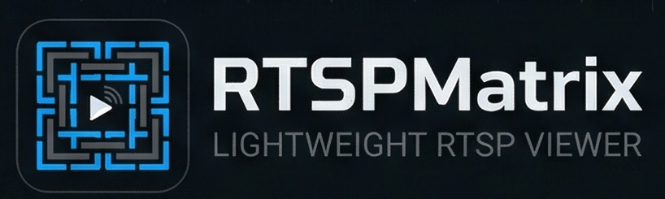

<p align="center">
  
</p>

# RTSPMatrix

Lightweight, cross-platform RTSP grid viewer for Dahua and compatible DVR/NVR devices.
Built with PyQt5 and libVLC. Fast, portable grid monitor (1--16 streams), instant
channel-to-tile assignment, saved views, resilience with auto-reconnect, and a virtual
scrolling mode for navigating large channel counts without reconnecting.

## Motivation

Dahua SmartPSS Lite is unreliable in practice -- incompatibilities, inconsistent behavior
across macOS/Linux/Windows, breakage after updates. There is also no good portable,
minimal RTSP viewer that starts fast and does not hang when a stream is missing.

RTSPMatrix targets the "open RTSP now, no vendor bloat" use case.

## Two viewer modes

### Classic (`rtspmatrix.py`)

Grid of 1--16 tiles. Click a tile to focus it, press a channel button to assign a stream.
Each tile owns its own VLC player; switching channels does a full reconnect.

- **Double-click** a tile to go fullscreen (no reconnect -- in-place rebind)
- Press any key to exit fullscreen
- Per-tile exponential-backoff retry on stall or timeout
- Throughput-pulse stall detection (30 s rolling window catches frozen streams that
  libVLC doesn't report as errors)
- Staggered RTSP opens when increasing pane count or applying a view (reduces DVR load)
- Per-tile stats overlay: FPS, bitrate (Mbps), lost frames (green marquee on video)
- Aggregate status bar: playing/idle count, total bandwidth, lost frames/s

### Virtual (`rtspmatrix-vitual.py`)

Sliding-window view into a larger pool of active channels. Example: 2x2 visible tiles
with 16 active channels arranged as an 8x2 virtual matrix.

Key behavior:
- **All** active channels stay connected at all times (each on its own hidden VLC player)
- Scrolling the visible window **rebinds** players to tiles -- no RTSP reconnect
- Only newly added channels open fresh RTSP sessions
- **Left/Right** arrows (or buttons) scroll by one column
- **Double-click** a tile for fullscreen; Left/Right in fullscreen steps through channels
  with the same zero-reconnect rebind
- **Right-click** a channel button to exclude/include it from the active rotation
- "Channel List" dialog for batch exclude/include

## Features (both modes)

- **Configurable grid**: 1--16 tiles
- **16 channel buttons** with optional labels
- **Views**: save/load/delete named layouts (grid size + channel assignments)
- **Session restore**: last state (panes, assignments, scroll position, excluded channels)
  written atomically on close / Ctrl+C and restored on next launch
- **Dual subtype**: `subtype_tile` for grid (substream), `subtype_full` for fullscreen
  (mainstream) -- configured in `rtsp.ini`
- **Internal profiler**: named timers / counters / gauges, dumped to log on interval;
  zero overhead when disabled (`profile=true` in `[app]`)
- **About dialog** (Help menu): OS, Python, Qt/PyQt5, libVLC versions, connection
  config, tuning knobs -- with Copy button
- **Clean shutdown**: Ctrl+C / SIGINT handled gracefully

## Requirements

- Python 3.10+ (older may work)
- **libVLC** (the library, not the VLC player UI)
- Python packages: `PyQt5`, `python-vlc`

## Install

### 1. Install libVLC

**macOS**
```bash
brew install --cask vlc
```

**Debian / Ubuntu**
```bash
sudo apt install libvlc5 vlc-plugin-base
```

**AlmaLinux / Fedora**
```bash
sudo dnf install libvlc vlc-plugins-base
```

**Arch**
```bash
sudo pacman -S vlc
```

**Windows** -- install VLC from <https://www.videolan.org/vlc/>.
The installer puts `libvlc.dll` on the system; if not found automatically, set
`VLC_PATH=C:\path\to\VLC` in your environment.

### 2. Set up Python environment

```bash
python3 -m venv venv
source venv/bin/activate
python3 -m pip install -U pip
python3 -m pip install PyQt5 python-vlc
```

Or from `requirements.txt`:

```bash
pip install -r requirements.txt
```

### 3. Configure

Copy the example config and fill in your DVR credentials:

```bash
cp rtsp-example.ini rtsp.ini
```

Edit `rtsp.ini`:

```ini
[rtsp]
host = 192.168.1.108
port = 554
user = admin
password = YOUR_PASSWORD

# Substream for tiles (lower bandwidth), mainstream for fullscreen
subtype_tile = 1
subtype_full = 0

[app]
title = RTSPMatrix
default_panes = 4
```

See `rtsp-example.ini` for the full list of tuning knobs (network caching, timeouts,
stagger delay, hardware decode toggle, profiler).

## Run

```bash
source venv/bin/activate

# Classic grid viewer
python rtspmatrix.py

# Virtual / scrolling viewer
python rtspmatrix-vitual.py
```

## Platform notes

| Platform | Notes |
|---|---|
| **macOS** | Hardware decode (VideoToolbox) disabled by default -- can deadlock on glitchy RTSP. Override with `disable_hw_decode=0` in `rtsp.ini`. |
| **Linux (Wayland)** | Forces XCB backend so `set_xwindow()` gets a real X11 handle. Override with `QT_QPA_PLATFORM=wayland` if needed. |
| **Windows** | Auto-searches common VLC install paths for `libvlc.dll`. Set `VLC_PATH` if not found. |

## License

[MIT](LICENSE) -- Pawel Suchanecki
